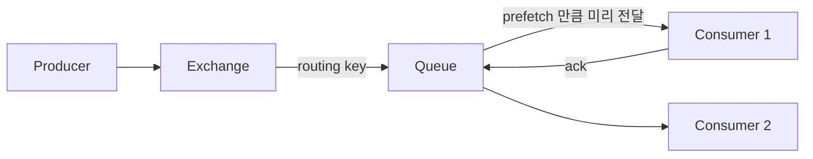

> 예시 노트입니다. 형식 확인 후 지워도 됩니다.

## 원본 메모
(예시) AI 작업 대기열을 붙이다가 메시지 흐름을 처음 정리함

## 정리
프로듀서는 익스체인지로 메시지를 보내고, 익스체인지가 라우팅 규칙에 따라 큐에 넣는다. 컨슈머는 큐에서 메시지를 받아 처리한 뒤 ack를 보낸다.

## 다이어그램

```mermaid
flowchart LR
  P[Producer] --> X[Exchange]
  X -->|routing key| Q[Queue]
  Q -->|prefetch 만큼 미리 전달| C1[Consumer 1]
  Q --> C2[Consumer 2]
  C1 -->|ack| Q
```
