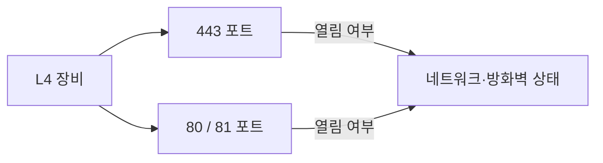

## 원본 메모
(별도 원본 메모 없음. [[L4 포트 오픈 여부와 방화벽 상태]]를 정리하면서 `part_of` 부모 노트로 만들었다.)

## 정리
네트워크·방화벽 관련 개념을 묶는 부모 노트. 하위 개념: [[L4 포트 오픈 여부와 방화벽 상태]]

## 다이어그램

```mermaid
flowchart LR
  L4[L4 장비] --> P443[443 포트]
  L4 --> P80["80 / 81 포트"]
  P443 -->|열림 여부| S[네트워크·방화벽 상태]
  P80 -->|열림 여부| S
```
