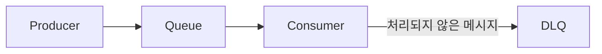

## 원본 메모
(별도 원본 메모 없음. [[DLQ]]를 정리하면서 `part_of` 부모 노트로 만들었다.)

## 정리
메시지 큐 관련 개념을 묶는 부모 노트. 하위 개념: [[DLQ]]

## 다이어그램

```mermaid
flowchart LR
  P[Producer] --> Q[Queue]
  Q --> C[Consumer]
  C -->|처리되지 않은 메시지| D[DLQ]
```
